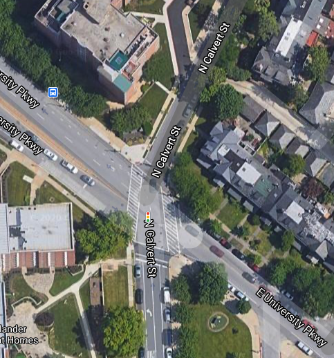
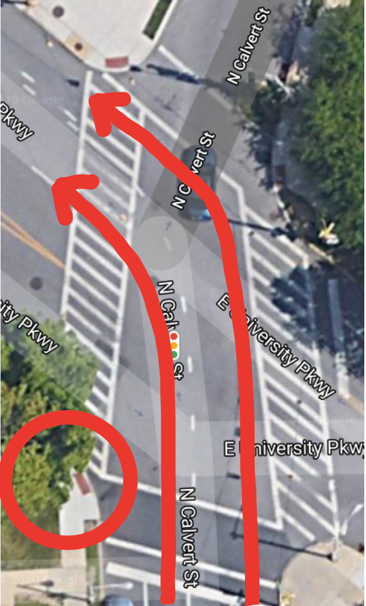

# HCI Assignment 2: Reflections on Accessiblitiy and Hostile Road Design in Baltimore

New York City is crowded. The traffic is a nightmare. Standing on a corner, you can watch a motley array of vehicles speed pass, from honking taxis to someone pulling three shopping carts piled two stories high with cans. 
Often, driving is slower than walking. 
And yet, as bad as it is, it pales in comparison to the behaviour that Baltimore denizens would like to pass off as "driving," but that would in any other place be classified as attempted manslaughter.
If I, as an able-bodied person, feel unwelcome as a pedestrian and biker in this city, then barriers facing those with physical disabilities are staggering. 
To illustrate these problems, let us focus in on one particular intersection that is likely familiar to those who have spent some time on Homewood Campus: North Calvert and University Parkway. 

What could be a standard intersection is turned into an unsafe, rage-inducing nightmare by poor design. I will use this intersection to illustrate some larger problems in the city as a whole, and argue that addressing these problems goes beyond traffic safety. 

## The problem
The following video, taking during rush hour on a weekday, illustrates the following scenario: you're a pedestrian trying to cross north on the west corner of University and Calvert. 
You have the light, but an endless stream of drivers turn left off of Calvert onto University block your path. Although you have the right of way, nobody slows down.

{}

When this happens, you have several choices: 

1. Take your life into your hands, start walking, stare down the driver in the front and hope that they're not texting and are willing to stop for you. Whenever I've done this, I get the types of bewildered looks from drivers typically reserved for strange occurrences, like a two-ton bison walking across the street. This option requires a good deal of chutzpah (and frustration). 
2. Wait for a break between the cars and run for it. This is, of course, contingent on there being a break, and furthermore, on your running ability, so this option is inaccessible to a large segment of the population. A segment which is already under-priviledged. 
3. Wait for the stream to end. Sometimes this means missing the light, especially at rush hour. 

Note that option 2 and often option 3 involve breaking the law yourself as a pedestrian, making them further inaccessible to over-policed populations. 
This problem isn't confined to this intersection. 
While overall traffic deaths were down in Baltimore in 2019, pedestrian and bicyclist deaths were up.^[https://www.baltimoresun.com/maryland/bs-md-traffic-fatalities-20190417-story.html]

## Hypothesized causes
It's very tempting to blame drivers, 
but it's also very unlikely that every single driver swining a left onto University between the hours of 4pm and 8pm is a malicious idiot (or one of the more colorful terms I've used while executing one of Options 1-3). 
The intersection is very poorly designed. 
Firstly, a pedestrian standing on the south-west corner of the intersection is not visible to a driver until they pass the parked vehicles on the west side of Calvert. 
Even if the pedestrian is visible, the fact that University is so wide and the turn is an obtuse angle means that if their eyes are on the road in front of them, the driver might not see the pedestrian at all. 

This intersection illustrates the larger problem at hand: driving infrastructure has been prioritized over walking and biking infrastructure.
This implicitly prioritizes the needs of motorists over everyone else, something that motorists pick up on, leading to a sense of entitlement that is not wholly undeserved.
Baltimore drivers should feel entitled; a whole city has been designed and optimized to serve their needs! 
That feeling of entitlement extends beyond yielding to pedestrians at signals: in my time here, I've seen such "creative" driving techniques as:

- driving the wrong way down a 3-lane road 
- driving on the sidewalk (frequent) 
- driving a 4x4 clean over a raised traffic median to execute an illegal U-turn 
- countless instances of drivers treating red lights as "stoptional". 

Some of these behaviours aren't just due to culture, but also due to safety concerns. 
When I moved to Baltimore, a friend who'd been living here for a few years gave me a few tips for driving in Baltimore (especially at night) including

- know when you're in an area where you might need to run a light
- don't pull up to close to the car in front of you at an intersection: you don't want to be boxed in.

These safety concerns are amplified for residents without the safety of a locked car. 
I've frequently heard friends and neighbors express concern about walking or biking somewhere, even in neighborhoods considered by most to be safe. 
I will say that these concerns are largely unfounded: most of Baltimore is quite walkable and bikeable. But facts don't really matter in these situations: it's the reputation that counts. 

This creates a vicious cycle: people don't want to walk or bike because it feels unsafe, so they drive. More drivers means more people demanding that the city be designed to meet their needs. 
More pedestrian-hostile roads mean fewer pedestrians and bikers. Fewer pedestrians and bikers give the city an empty, forelorn feeling, disincentivizing those who would overwise walk. Rinse and repeat.  

## Proposed fixes
So how can the cycle be broken? Let's look back at our intersection. Just in this one intersection, here are some changes that could be implemented by, say, a few disgruntled PhD students with some time to spare.

1. **Give pedestrians a head start**: there's a traffic light on Calvert that could be asyncronously timed with the pedestrian light, so that pedestrians have, say, 30 seconds to cross the street before the traffic from Calvert gets to go. This would make the intersection more accessible to those incapable of sprinting across. It would also send a message to drivers by literally prioritizing pedestrians. 
2. **Install a red light camera**: another problem at this intersection is drivers making illegal lefts on red when there's less traffic on University. 
3. **Bottleneck the intersection with a bump-out**: remove the final two parking spaces on Calvert with a "bump-out".^[https://www.wired.com/2016/10/how-to-design-better-cities/] A bump-out is a raised extension of the sidewalk that pushes into the road. It can be covered in low-growing shrubs or thin tall saplings. The effect of a bump-out is two-fold. In removing the parked cars closest to the intersection, it increases pedestrian visibility. It can also be extended into the road itself, creating a bottleneck. A two-lane road becomes a one-lane road, and drivers are forced to slow down, increasing the chance that I can make eye contact with them and hit them with my most searing glare. 

Some other changes that could be made around the city include:

1. **Protected bike lanes** 
2. **Lower curbs**: why on earth are the curbs in this city so high? A high curb is a barrier to anyone in a wheelchair, and forces bicyclists to choose between wiping out and getting hit by a car, instead of safely bailing out onto the sidewalk if, for example, there is a pothole. 
3. **Protective bollards**: implemented in many European cities to prevent vehicular terrorist attacks, concrete bollards would help stop drivers from driving on the sidewalk. 

## Broader impacts 
The obvious impacts of these changes are improved pedestrian and bike safety.
This means greater accessibility for diverse groups, such as 

- people with physical disabilities 
- those who are unable to afford vehicles 
- over-policed groups 

But they might improve other factors as well: for example, an improved and more conscientious driving culture might also result in fewer driver deaths and injuries. 
Improvements might well extend beyond this: I would argue that increasing the number of pedestrians and bicyclists, and slowing the rate of traffic, offers significant economic upsides. 
When people drive places, they typically have a destination in mind. Nobody pulls their car over because they saw a cute cafe and want a latte. Pedestrians and bikers see more storefronts, and are more likely to go in and grab a cup of coffee or check out a new clothing shop. 
Increased pedestrian density would likely also lead to improved safety; each pedestrian is a witness to any potential crimes, reducing the likelihood of any occurring. 
Finally, walking and biking have been shown to improve not just physical, but also mental health.^[https://www.ncbi.nlm.nih.gov/pmc/articles/PMC1470658/]
Similarly, increased access to greenspace has been shown to have similar outcomes.^[https://www.pnas.org/content/116/11/5188]
This addresses Baltimore's safety problem proactively, indirectly tackling the correlates of violent crime. 

