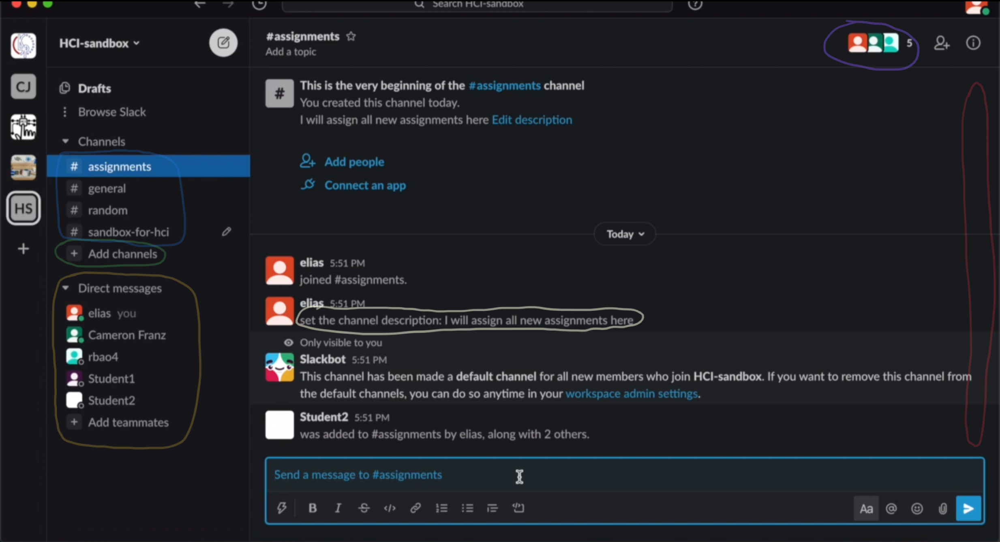

# Project 1: Slack re-design
### Ariel Bao, Cameron Franz, Elias Stengel-Eskin

Due to the COVID-19 pandemic, many aspects of life including education have moved to a largely online setting. 
This has created new challenges but also new opportunities for streamlining and improving educational experiences. 
The Slack platform is incredibly popular in modern office spaces and offers rapid and efficient communication, we believe that with some minor changes, it could provide and integrated educational environment that enriches student-instructor interactions. 
In particular, the rapid feedback available through Slack might provide a suitable proxy for face-to-face communication while accommodating individuals facing the myriad additional challenges of teaching and studying from home (e.g. different timezones, unreliable internet, personal responsiblities, etc.). 

In this project, we focus on the perspective of the instructor, as in a course the instructor typically plays a more active role with the students largely acting as consumers. 
Our product is designed for a modified course structure, which has been adjusted for remote learning.
Students are expected to watch pre-recorded lectures on their own time, and there are mandatory 1-hour office-hour-style discussion periods once a week.
Each week has two lectures. The course has 3 assignments and 2 group projects.

## Persona 1: Instructor 
TODO 

## Contextual inquiry 

### Subject 
The contextual inquiry was conducted with a student with TA-ing experience who has used Slack in the past, but not extensively. 

### Intents 
1. Create an assignment and share it with all students 
{}
{}

The subject created a new channel for all assignments; this behaviour was unexpected as we expected him to create separate channels for each assignment. 
The subject added all students which is the default, and posted a stub assignment. 

2. Send each student their graded assignment with feedback 
{}
{}

The subject sent an individual message to each student with their grade and feedback. 
The subject made one message and the copy-pasted it to each student.
This wouldn't scale well to a larger class, and makes it easy to make mistakes (e.g. sending the wrong grade to a student, sending the wrong feedback). 

3. Assign students to groups for the group project 
{}
{}

Subject created a thread per group and added students manually. 
It would probably be helpful to have a shortcut to easily group students into random or non-random groups and assign them to threads. 
  
4. Assign each group a topic
{}
{}

   Subject first used message in thread to assign topic, then saw that threads can have topics, and used the thread topic feature to assign a topic to each group. 

5. Create a discussion thread for the weekly office hour and send students a required reading for that week’s office hour 
{}
{}

Subject successfully created a thread and added a required reading. 
There is no way to enforce that everyone actually has to open or read the meeting. 

## Ideation and Analysis 

## Channels were used for Groups and Assignments

_A classroom slack environment with relevant areas circled_	

We found that channels (circled in blue) were used for making groups and creating discussion around assignments. To create a channel, the instructor clicks the Add Channel button (green circle). A channel dedicated to sending assignments to students was relatively fast: the instructor simply creates a channel and has it automatically add everyone.
Using channels for groups was more tedious. For each group, the instructor needed to click “Add Channel” and type the name of everyone in the group. This means that the instructor would need to create their groups somewhere else (like Excel) and then do a bunch of copy and pasting or typing, even though all of the names are already in Slack.
We believe that it should be easier to automatically populate channels with randomly assigned groups in a way that minimizes instructor effort while maximizing flexibility. 
Furthermore, given the increased number of students who are learning remotely from all over the world, we believe that any changes should natively support grouping students by timezone. 

### Direct messages were used to give feedback to students
Direct messages were used for giving grades and feedback. For each student the instructor would: click on that student, paste a message like “You got a 95%, my feedback is X”, edit that message, and then send the DM. Doing this for each student is obviously tedious, and it does beg a further question: does the instructor have their grades and feedback in some other document (like Excel) and is pasting them over? Or are they going to each student, grading their assignment, and sending messages as they go?
In the Excel case it is a lot of copying and pasting to send a DM to every student, and being able to automatically send templated messages from a spreadsheet would be useful. In the grading-as-they-go case, keeping track of who has been graded would be tedious. In our first CI we did not get far enough into the details of how an instructor grades work to answer this question. Yet we can guess from platforms like Gradescope that instructors like to type out their grade and feedback once without having to later copy and paste into some other platform.
We believe that if Slack is to be used for classroom interactions, there should be an easy-to-use interface for managing and updating coursework. 

### Finding information involved a lot of browsing for students
We also looked at the Slack classroom from the perspective of a student. In finding out what they need to do, we found that our volunteer student traveled broadly around the Slack classroom. They clicked on multiple channels (the bold ones that indicated unread messages) to look for any relevant new information. They clicked on the channel relevant to their assignment and looked for the original information from the instructor. In general we found that the student, who was using Slack for iOS, was swiping back and forth between the channel menu and the messages area often. They also had to scroll far up in the assignment info to find the pinned information from the instructor.
![Slack Diagram][SlackDiagram1.png]
_Diagram of how the user performed the various actions during the contextual inquiries_

In order to minimize the amount of time spent by students traveling between features, we propose adding shortcuts to the interface which allow students to rapidly jump past pinned information. 

